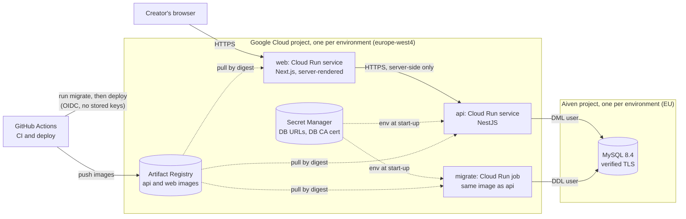
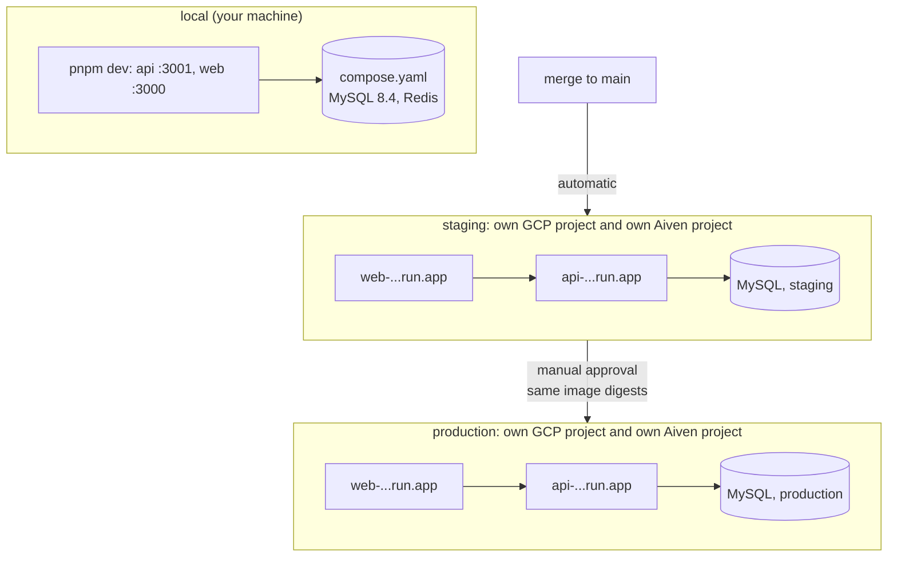
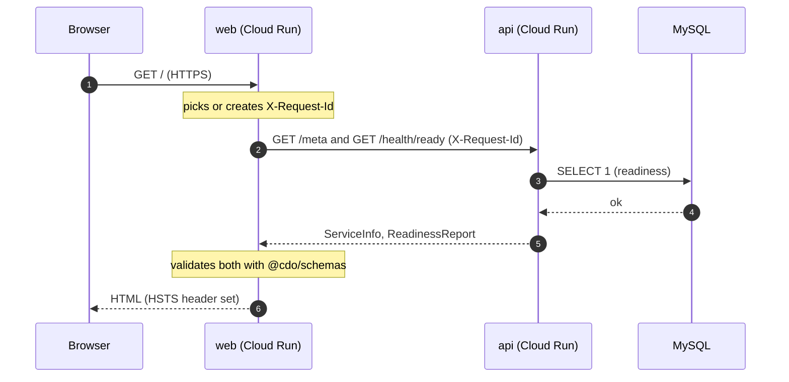
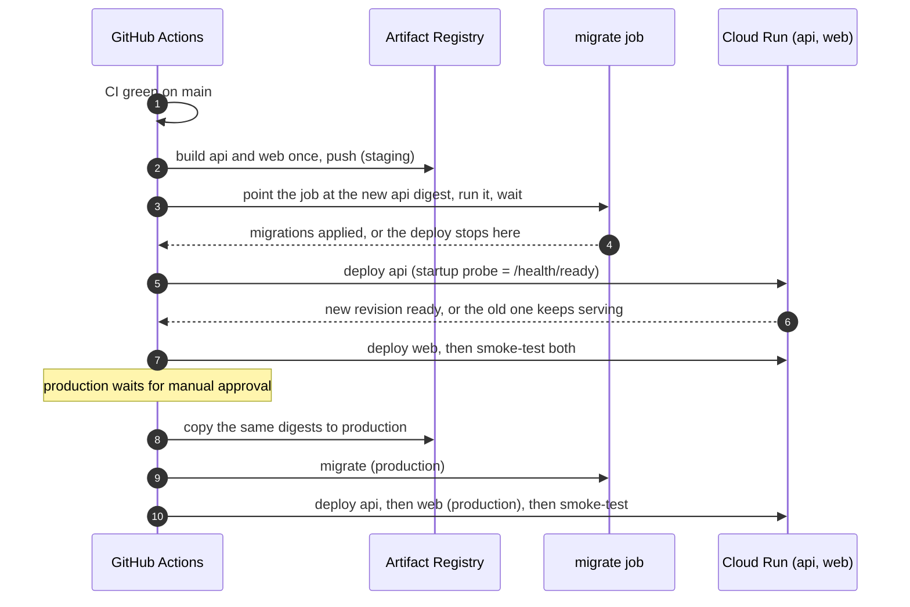

# Architecture

**Status:** Phase 0 of [ADR-005](adr/005-hosting-and-environments.md), checked 2026-10-04.
- **Phase 0 is a personal project on free tiers, with no real user data yet.**
- This file describes the system as it runs today. It names what changes at each later phase and links the decision behind each part.

## The system in one picture

**Rules this picture encodes:**
- **The browser only talks to `web`.** `web` calls `api` from the server, so the browser never makes a cross-origin request: no CORS, and no third-party cookies once auth arrives (M2).
- **The API connects as a user that can't change the schema.** Only the `migrate` job holds DDL rights.
- **Images are referenced by digest,** so production runs exactly the bytes staging tested.

## Components

| Part | Code | What it does | Decision |
|---|---|---|---|
| **web** | `apps/web` | Next.js App Router. Renders pages and calls the API on the server; its env is validated with zod. Liveness: `GET /api/health`. | [ADR-001](adr/001-monorepo-structure.md) |
| **api** | `apps/api` | NestJS. Owns the database and every business rule. Liveness: `GET /health`. Readiness: `GET /health/ready`, which checks MySQL. | ADR-001, [design note](design/api-runtime-foundations.md) |
| **migrate** | `apps/api/src/database/migrate.ts` | Applies pending migrations under a MySQL lock. Refuses unacknowledged destructive statements. | [ADR-002](adr/002-orm-choice.md), [design note](design/deployment.md) |
| **schemas** | `packages/schemas` | zod contracts shared by api and web (`/meta`, readiness report). | ADR-001 |
| **MySQL** | `compose.yaml` locally; Aiven in deployed environments | MySQL 8.4, UTF-8 (`utf8mb4`), UTC. | ADR-002, [ADR-005](adr/005-hosting-and-environments.md) |

## Environments

| | Local | Staging | Production |
|---|---|---|---|
| **Deployed by** | `pnpm dev` | Every merge to `main`, after CI passes | Manual approval, after staging passed |
| **Data** | Your local database | Made-up data only | Real data (none until M5) |
| **Secrets** | `.env` (git-ignored) | Staging Secret Manager | Production Secret Manager |
| **Stripe** | Test mode | Test mode | Test mode until a company exists (ADR-000) |
| **Cloud identity** | n/a | `staging` GitHub Environment → staging deployer | `production` GitHub Environment (needs approval) → production deployer |

**Separation is enforced, not promised:**
- **Separate projects:** nothing in staging can reach production.
- **Separate deploy credentials:** production's credentials are only issued to a job running in the approved `production` GitHub Environment.
- **No copies of production data:** production data is never copied to staging or local. Restore drills run inside production's own project.

## A request

**Following one request:** the request ID appears on every API log line, so you can filter a page view end to end in Cloud Logging.

## A deploy

**Pipeline details** (expand/contract, rollback, secrets): [docs/design/deployment.md](design/deployment.md) and [docs/runbooks/deploy-and-rollback.md](runbooks/deploy-and-rollback.md).

## Cross-cutting rules

- **Config:** each app validates its env with zod at start-up and refuses to boot when it's wrong. Only the env module reads `process.env`.
- **Time:** UTC everywhere: the MySQL session, the logs, the API's ISO-8601 strings.
- **Health:**
  - Liveness never checks dependencies.
  - Readiness does.
  - New releases are gated on readiness.
- **Shutdown:** on SIGTERM:
  1. readiness answers 503
  2. in-flight requests drain
  3. the pool closes
  4. the process exits 0

  `SHUTDOWN_TIMEOUT_MS` stays inside Cloud Run's 10-second grace period.
- **Logs:** one JSON line per event to stdout, which Cloud Logging picks up. Secrets and personal data are redacted.
- **Tenancy (M2):** a `workspace_id` on every tenant-owned table, plus scoped repositories ([ADR-002](adr/002-orm-choice.md)).

## What changes later

| When | Change | Decision |
|---|---|---|
| M2 | Auth. The browser reaches the API through `web` (same origin), so session cookies stay first-party. | Auth ADR (M2) |
| M3 | Private file storage for contracts, with signed URLs. | Storage ADR (M3) |
| M4 | Redis and a BullMQ worker, for reminders and the digest. | Redis ADR (M4) |
| **Phase 1** (before real user data) | MySQL moves to **Cloud SQL 8.4 with PITR**; custom domain. | [ADR-005](adr/005-hosting-and-environments.md) |
| **Phase 2** (paying customers) | Minimum instances (no cold starts), a database standby, a load balancer. Stay on GCP or move to AWS. | New ADR |

## Decisions index

- [ADR-000](adr/000-billing-provider.md): billing provider (Stripe Billing + Stripe Tax)
- [ADR-001](adr/001-monorepo-structure.md): monorepo structure
- [ADR-002](adr/002-orm-choice.md): ORM (Drizzle + mysql2)
- [ADR-003](adr/003-repo-visibility-and-license.md): repo visibility and license
- [ADR-005](adr/005-hosting-and-environments.md): hosting and environments
